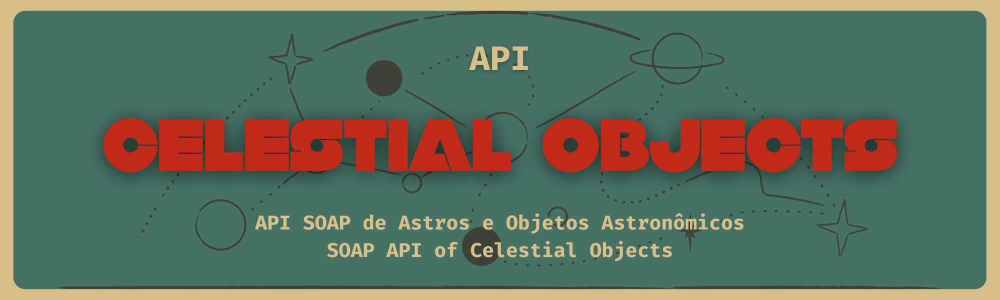

# 🌌 Celestial Objects API

## 📘 Sobre esta API | About this API

**PT-BR:**  
A proposta deste projeto é desenvolver uma API que implemente, de forma básica, um sistema baseado no protocolo SOAP. Embora este protocolo seja antigo e tenha sido substituído em muitos contextos pelo REST, ainda é amplamente utilizado em aplicações legadas.  
Além disso, este projeto também propõe a criação de uma API REST de professores que consome a API de objetos celestiais.

**EN:**  
The goal of this project is to build an API that implements a basic SOAP-based system. Although SOAP is an older protocol and has been replaced in many contexts by REST, it is still widely used in legacy applications.  
In addition, the project proposes building a REST API for teachers that consumes the Celestial Objects API.

---

## 💡 Pontos de Melhoria | Areas for Improvement

**PT-BR:**  
Como o foco foi o estudo simples do protocolo SOAP, a modelagem de negócio, o tratamento de erros e as boas práticas SOAP não foram aprofundadas. Para evoluir este sistema, recomendo iniciar pelos seguintes pontos:

1. Tratamento de erros e exceções mais robusto
2. Melhorar a exposição das respostas via DTO para mais segurança e legibilidade
3. Dividir o arquivo `/schemas/celestialObjects.xsd` em múltiplos arquivos menores
4. Mover a lógica de transformação dos objetos do endpoint para o service

**EN:**  
As the goal was to study the SOAP protocol simply, business modeling, error handling, and SOAP best practices were not fully addressed. To improve the system, I recommend starting with:

1. More robust error and exception handling
2. Better response encapsulation using DTOs for security and clarity
3. Splitting the `/schemas/celestialObjects.xsd` file for better organization
4. Moving object transformation logic from the endpoint to the service layer

---

## 🌠 Sobre o Modelo | About the Model

**PT-BR:**  
Sempre fui apaixonado pelo espaço, e este projeto foi uma oportunidade divertida de sair da minha zona de conforto e trabalhar com um tema diferente durante os estudos.  
Abaixo você encontrará o diagrama de entidade-relacionamento das entidades deste sistema.

**EN:**  
I've always been passionate about space, and this project gave me a fun opportunity to step out of my comfort zone and work on a themed application while studying.  
Below, you can find the entity-relationship diagram of this system.

---

## 🚀 Passos para Executar | Steps to Run

> 💡 Esta aplicação foi desenvolvida e testada em Linux, mas deve funcionar normalmente no Windows e macOS.  
> 💡 This application was developed and tested on Linux, but it should also work fine on Windows and macOS.

### ✅ Requisitos | Requirements

**PT-BR:**
- Java 21 instalado e com as variáveis de ambiente configuradas
- Maven instalado (utilizei a versão 3.6.3)
- Git instalado (para clonar o repositório)
- IDE de sua preferência (recomendo IntelliJ)
- MongoDB instalado localmente

**EN:**
- Java 21 installed with environment variables configured
- Maven installed (I used version 3.6.3)
- Git installed (to clone the repository)
- IDE of your choice (I recommend IntelliJ)
- MongoDB installed locally

---

### 🔧 Etapas | Steps

**1. Clonar o repositório | Clone the repository**
```bash
git clone https://github.com/DaniloVolles/celestialObjectsAPI.git
```

**2. Abrir o projeto na IDE de sua preferência | Open the project in your preferred IDE**  
_Recomendação | Recommendation: IntelliJ IDEA_

---

**3. Compilar o projeto | Compile the project**

> ⚠️ Opcional, mas pode ajudar a verificar a integridade do projeto.  
> Não se assuste com erros: diversas classes são geradas automagicamente a partir do arquivo XSD.
>
> ⚠️ This is optional but can help verify the integrity of the project.  
> Don’t worry about errors: several classes are magically auto-generated from the XSD file.

```bash
mvn clean compile
```

---

**4. Executar o projeto | Run the project**
```bash
mvn spring-boot:run
```

---

## 🧪 Testando a Aplicação | Testing the Application

**PT-BR:**  
Para testar, basta importar a collection do Postman que está na pasta `resources`.

**EN:**  
To test, simply import the Postman collection located in the `resources` folder.
